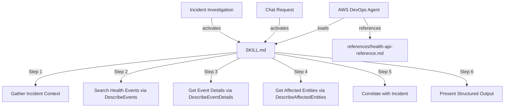

# Design Document

## Overview

The AWS Health Events skill is a set of markdown-based instructions that guide the AWS DevOps Agent to retrieve and analyze AWS Health events during incident investigation, root cause analysis, and chat-based reporting. The skill follows the same structural pattern as the existing `support-cases` skill: a SKILL.md with frontmatter and step-by-step agent instructions, a README.md with documentation, a references/ directory with API documentation, and an evals/ directory with evaluation tests.

The skill instructs the agent to use three AWS Health API operations:
- **DescribeEvents** — retrieve health events filtered by service, time, status, and type
- **DescribeEventDetails** — get full descriptions and timelines for specific events
- **DescribeAffectedEntities** — identify which account resources are impacted

The skill activates in two contexts:
1. **Incident investigation** — automatically alongside support-cases to surface AWS-side events as potential root causes
2. **Chat reporting** — on-demand health event summaries over configurable time periods

## Architecture

The skill is not executable code — it is a structured set of markdown documents that the AWS DevOps Agent loads into its context and follows as instructions. The architecture is the file layout and the logical flow of instructions within SKILL.md.



### File Structure

```
skills/aws-health-events/
├── SKILL.md                          # Main skill instructions with frontmatter
├── README.md                         # Documentation, prerequisites, sample prompts
├── CHANGELOG.md                      # Version history (starting at 1.0.0)
├── .skilleval.yaml                   # Eval framework config
├── evals/
│   ├── evals.json                    # Functional evaluation scenarios
│   └── eval_queries.json             # Trigger tests (should_trigger: false only)
└── references/
    └── health-api-reference.md       # AWS Health API quick reference
```

## Components and Interfaces

### Component 1: SKILL.md

The primary instruction document. Contains:

**Frontmatter:**
- `name`: `aws-health-events`
- `description`: Activation trigger description covering incident investigation, service degradation, and health event reporting scenarios
- `metadata.author`: `udid-aws`
- `metadata.version`: `"1.0.0"`

**Instruction Flow (6 steps):**

| Step | Purpose | API Used | Key Logic |
|------|---------|----------|-----------|
| 1 | Gather incident context | None | Extract affected services, timeframe, resources, region |
| 2 | Search health events | DescribeEvents | Filter by service, time, region, status; handle pagination |
| 3 | Get event details | DescribeEventDetails | Batch up to 10 ARNs per call; extract descriptions |
| 4 | Identify affected entities | DescribeAffectedEntities | Only for ACCOUNT_SPECIFIC events; match against incident resources |
| 5 | Correlate with incident | None | Score relevance (High/Medium/Low); identify contributing factors |
| 6 | Present findings | None | Structured output grouped by category, sorted by relevance |

**Decision Tree:**
- Known service → search that service (7 days) → if empty, search related services → if empty, expand to 14 days
- Unknown service → search all services filtered by region/AZ (7 days)
- Chat report → search specified time period (default 30 days, max 90 days)

**Error Handling Instructions:**
- Missing permissions → report required IAM actions
- Throttling (429) → retry with exponential backoff (1s, 2s, 4s, max 3 retries)
- Service error (5xx) → report error, recommend Health Dashboard fallback
- Timeout (30s) → abort and report timeout
- Zero results → report no events found, suggest other investigation paths

### Component 2: references/health-api-reference.md

Quick-reference document for the three AWS Health API operations. Structured as tables with:
- Key parameters (name, type, description, constraints)
- Response fields (field name, description)
- Common service codes mapping (service name → Health API service namespace)
- Event type categories and statuses
- Important constraints (region, pagination, rate limits, batch sizes)

### Component 3: README.md

User-facing documentation following the project convention structure:
1. Title
2. Purpose
3. Key Capabilities
4. Prerequisites (IAM permissions, Health API access)
5. Limitations (API region, data availability)
6. Agent Types (Chat tasks, Incident RCA)
7. Uploading to AWS DevOps Agent
8. How to Use This Skill (sample prompts for Chat and Investigation)

### Component 4: Evaluation Tests

**evals.json** — Functional scenarios testing:
- Incident-triggered health event retrieval
- Event detail extraction
- Affected entity identification and resource matching
- Correlation and relevance scoring
- Chat-based report generation
- Error handling (no events found, API errors)
- Region awareness (us-east-1 endpoint)

**eval_queries.json** — Negative trigger tests (queries that should NOT activate this skill):
- General AWS questions unrelated to health events or incidents
- Configuration/architecture questions
- Code-related questions

### Component 5: CHANGELOG.md

Simple version history starting at 1.0.0 with "Initial version".

### Component 6: .skilleval.yaml

Evaluation framework configuration ignoring STR-016 (README alongside SKILL.md is intentional).

## Data Models

This skill does not persist data. It operates on transient API responses. The key data structures the agent works with are:

### Health Event (from DescribeEvents response)

| Field | Type | Description |
|-------|------|-------------|
| arn | String | Unique event identifier |
| service | String | AWS service namespace (e.g., `EC2`, `RDS`) |
| eventTypeCode | String | Specific event type (e.g., `AWS_EC2_OPERATIONAL_ISSUE`) |
| eventTypeCategory | String | `issue`, `scheduledChange`, or `accountNotification` |
| region | String | AWS region (e.g., `us-east-1`) |
| availabilityZone | String | Specific AZ if applicable |
| startTime | ISO 8601 | When the event started |
| endTime | ISO 8601 | When the event ended (null if ongoing) |
| lastUpdatedTime | ISO 8601 | Last update timestamp |
| statusCode | String | `open`, `closed`, or `upcoming` |
| eventScopeCode | String | `ACCOUNT_SPECIFIC` or `PUBLIC` |

### Event Detail (from DescribeEventDetails response)

| Field | Type | Description |
|-------|------|-------------|
| event | Object | The event object (same fields as above) |
| eventDescription | Object | Contains `latestDescription` text |
| eventMetadata | Map | Additional metadata key-value pairs |

### Affected Entity (from DescribeAffectedEntities response)

| Field | Type | Description |
|-------|------|-------------|
| entityValue | String | Resource ARN or ID |
| eventArn | String | Associated event ARN |
| awsAccountId | String | Account owning the resource |
| lastUpdatedTime | ISO 8601 | Last status update |
| statusCode | String | `IMPAIRED`, `UNIMPAIRED`, `UNKNOWN`, `PENDING` |
| tags | Map | Resource tags |

### Relevance Classification (agent-computed)

| Classification | Criteria |
|---------------|----------|
| High | Matching service + overlapping timeframe + matching affected resource (or matching region/AZ if no resource IDs available) |
| Medium | Matching service + overlapping timeframe (no resource match) |
| Low | Matching service only (no timeframe overlap) |

### Service Dependency Map (for broadened searches)

| Primary Service | Related Services to Check |
|----------------|--------------------------|
| ELB/ALB/NLB | EC2, VPC, Route 53 |
| RDS | EC2, EBS |
| ECS/EKS | EC2, VPC, ELB |
| Lambda | VPC, CloudWatch |
| CloudFront | S3, Route 53 |
| API Gateway | Lambda, VPC |

## Error Handling

Error handling is encoded as agent instructions within SKILL.md. The agent follows these rules:

| Error Condition | Agent Behavior |
|----------------|----------------|
| Missing `health:Describe*` permissions | Report required IAM actions: `health:DescribeEvents`, `health:DescribeEventDetails`, `health:DescribeAffectedEntities`, `health:DescribeEventTypes` |
| Throttling (HTTP 429) | Retry with exponential backoff: 1s → 2s → 4s (max 3 retries), then report rate-limited |
| Service error (HTTP 5xx) | Report error code, recommend checking https://health.aws.amazon.com directly |
| Timeout (30 seconds) | Abort request, report timeout to operator |
| Invalid time range (start > end) | Report invalid time range error |
| Zero events found | Report no events matched, suggest other investigation paths |
| DescribeEventDetails failedSet | Report failed ARNs, continue with successfulSet |
| DescribeAffectedEntities error | Report event ARN that failed, continue with remaining events |
| Unknown service name (chat report) | Inform user service not recognized, list services with events in the period |

## Correctness Properties

*A property is a characteristic or behavior that should hold true across all valid executions of a system — essentially, a formal statement about what the system should do. Properties serve as the bridge between human-readable specifications and machine-verifiable correctness guarantees.*

Since this skill is a set of markdown instruction documents (not executable code with pure-function input/output behavior), traditional property-based testing does not apply. The input space is not programmatically enumerable, and the "execution" is an LLM following natural-language instructions. Instead, correctness is defined and verified through the following dimensions:

### Structural Correctness

Verified by the Agent Skill Eval audit framework:
- SKILL.md contains valid frontmatter with required fields (`name`, `description`, `metadata.author`, `metadata.version`)
- File structure matches the expected layout (SKILL.md, README.md, CHANGELOG.md, references/, evals/)
- All files use allowed extensions per DevOps Agent upload constraints
- No disallowed content (scripts, binary files, etc.)

### Behavioral Correctness (Agent Instruction Following)

Verified by functional evaluations (evals.json):

### Property 1: Correct API invocation for incident investigation

*For any* incident investigation prompt referencing an AWS service, the agent SHALL call DescribeEvents with the correct service filter and time range derived from the incident context.

**Validates: Requirements 1.1, 1.2**

### Property 2: Batch-constrained event detail retrieval

*For any* set of returned event ARNs, the agent SHALL call DescribeEventDetails in batches of at most 10 ARNs per request, processing all events without data loss.

**Validates: Requirements 2.1**

### Property 3: Affected entity lookup for account-specific events

*For any* event with eventScopeCode of ACCOUNT_SPECIFIC, the agent SHALL call DescribeAffectedEntities to identify impacted resources and match them against the incident context.

**Validates: Requirements 3.1**

### Property 4: Relevance classification consistency

*For any* set of health events and incident context, the agent SHALL classify each event's relevance as High, Medium, or Low using the defined criteria (service match + time overlap + resource match).

**Validates: Requirements 4.1**

### Property 5: Negative activation boundary

*For any* query unrelated to health events, service degradation, or incident investigation, the skill SHALL NOT activate.

**Validates: Requirements 5.1**

### Evaluation-Based Verification

Since universal quantification cannot be directly executed against an LLM, correctness is approximated through representative scenario coverage in the eval suite. Each functional eval scenario maps to one or more behavioral correctness properties above.

## Testing Strategy

Since this skill is a set of markdown instruction documents (not executable code), property-based testing does not apply. Testing uses the [Agent Skill Eval](https://github.com/aws-samples/sample-agent-skill-eval) framework with two evaluation types:

### Audit Evaluation (Structural Quality)

Validates the skill's file structure, frontmatter format, and content quality against the Agent Skills spec. The `.skilleval.yaml` configuration ignores STR-016 since README alongside SKILL.md is intentional per project conventions.

### Functional Evaluation (evals.json)

Scenario-based tests that verify the agent correctly follows the skill instructions when given specific prompts. Each test includes:
- `id`: Unique test identifier
- `prompt`: User input that should trigger the skill
- `expected_output`: Description of correct agent behavior
- `assertions`: Specific checks the output must satisfy

**Test scenarios to cover:**

| ID | Scenario | Key Assertions |
|----|----------|----------------|
| `incident-health-event-lookup` | Incident investigation triggers health event search | Calls DescribeEvents with correct service filter; presents events or states none found |
| `event-detail-extraction` | Retrieve details for identified events | Calls DescribeEventDetails; presents description, timeline, status |
| `affected-entity-matching` | Identify affected resources matching incident | Calls DescribeAffectedEntities; matches resources against incident context |
| `relevance-correlation` | Correlate events with incident context | Classifies relevance as High/Medium/Low; orders by relevance |
| `chat-health-report` | Generate health event summary report | Organizes by category; includes service breakdown and status counts |
| `no-events-found` | No matching health events exist | States no events found; suggests alternative investigation paths |
| `api-region-awareness` | Health API called from correct region | Uses us-east-1 endpoint regardless of resource region |
| `broadened-search` | Initial search returns no results | Expands to related services, then expands time window |

### Trigger Evaluation (eval_queries.json)

Negative tests verifying the skill does NOT activate for unrelated queries. Only `"should_trigger": false` tests are required (activation is implied by successful functional tests).

**Negative trigger examples:**
- General AWS architecture questions
- Code/programming questions
- Configuration questions unrelated to health events or incidents
- Questions about other AWS services without incident context

### Manual Testing

Before merging, the skill should be:
1. Zipped and uploaded to a DevOps Agent test environment
2. Tested with real prompts for both Chat and Incident RCA agent types
3. Verified against an account with actual Health events
